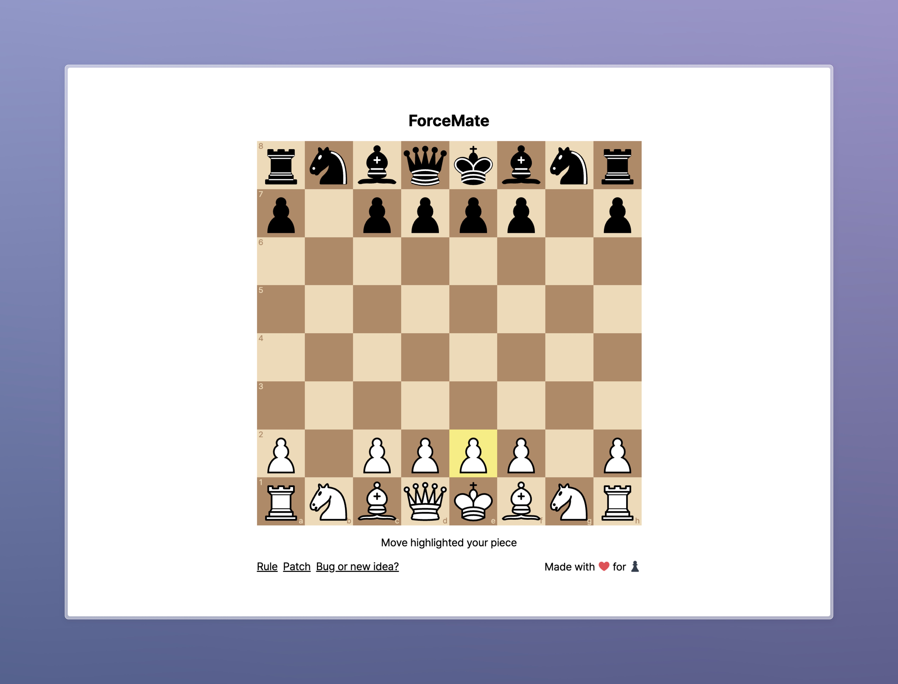

# ForceMate

> ## A chess variant for the deep thinkers

Play at https://forcemate.jeuk.io

## Rule

In **normal** chess, _**you**_ choose a piece and move it.  
But... what if you could choose the pieces your rival moves?  
In **ForceMate**, _**your rival**_ chooses a piece for you to move, and vice versa.

If all your pieces check after your rival's turn, you win.  
It's because the rival king is doomed no matter what piece your rival chooses.  
If either player has no legal moves left, the game ends in a stalemate.

Have fun!

## Patch note

| Date       | Version | Description                   |
| ---------- | ------- | ----------------------------- |
| 2024-08-13 | v1.0    | First version with basic rule |

## Contribution

Welcome all bug reports and idea sharing.

Contact me through `jeukhwang.dev(at)gmail(dot)com` or [GitHub Issue](https://github.com/JeukHwang/forcemate/issues/new).

## Licenses and Attributions

- [chess.js](https://github.com/jhlywa/chess.js) as a logic provider
- [react-chessboard](https://github.com/Clariity/react-chessboard) as a visualizer
- [tossface](https://toss.im/tossface) as a font, favicon
